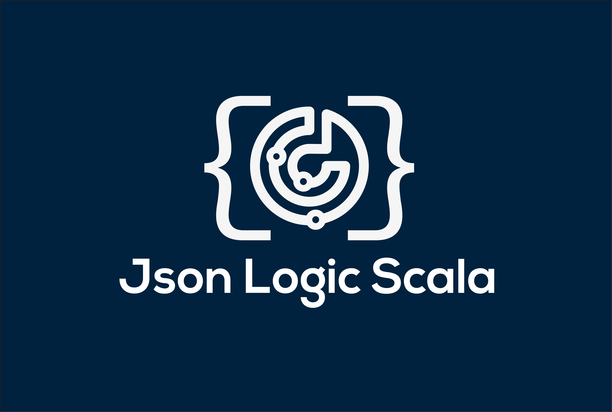

# Json Logic Scala

[]()
[](https://github.com/celadari/json-logic-scala/actions/workflows/linter.yml)
[](https://github.com/celadari/json-logic-scala/actions/workflows/tests.yml)
[](https://github.com/celadari/json-logic-scala/actions/workflows/build.yml)
[](https://codecov.io/gh/celadari/json-logic-scala)
[]()



---


Build complex rules, serialize them as JSON, and execute them in Scala.

Json-logic-scala enables you to serialize in JSON format logical expressions.
It also enables you to load a scala object from a logical expression/JSON.

Due to Scala's strong static typed language nature, json-logic-scala requires JSON to add tell type in json.

### Why would you use json-logic-scala ?
The [JsonLogic format](http://jsonlogic.com/) is designed to allow you to share rules (logic) between
front-end and back-end code (regardless of language difference), even to store
logic along with a record in a database.

Logic that has been exported from another language can be applied quickly on
scala.

### Scala Versions

This project is compiled, tested, and published for the following Scala versions:
* 2.11.12
* 2.12.6
* 2.13.2

# Table of Contents
1. [Installation]()

2. [Main concepts: Boolean-Algebra-Tree]()

    2.1 [`ComposeLogic`: Internal Node]()

    2.2 [`ValueLogic`: Leaf Node]()

3. [Example]()

4. [Read/Write json]()

    4.1 [Type information]()

    4.2 [Default built-in types]()

    4.3 [Read json: Define `Deserializer`]()

    4.4 [Write json: Define `Serializer`]()

5. [Evaluating logical expression: `eval` method]()
6. [Define custom operators]()
7. [Define EvaluatorValueLogic]()
8. [Define objects as Java services]()
9. [Scaladoc API]()
10. [Contributors]()


## 1. Installation

To get started, add json-logic-scala as a dependency to your project:

* sbt
    ```sbt
    libraryDependencies += "com.celadari" %% "json-logic-scala" % "2.0"
    ```

* Gradle
    ```gradle
    compile group: 'com.celadari', name: 'json-logic-scala_2.12', version: '2.0'
    ```
* Maven
    ```maven
    <dependency>
      <groupId>com.celadari</groupId>
      <artifactId>play-json_2.12</artifactId>
      <version>2.0</version>
    </dependency>
    ```
Json-logic-scala supports Scala 2.11 and 2.12. Choosing the right JAR is automatically managed in sbt. If you're using Gradle or Maven then you need to use the correct version in the artifactId.

## 2. Main concepts: Boolean-Algebra-Tree
Boolean expressions are complex boolean statements composed of atoms, unary, binary and multiple operators.
Atoms are assigned a value, and can be fed to a binary or unary expression.
For example, the logical expression

<p align="center">
    
</p>

can be parsed to the following Abstract Syntax Tree:

<p align="center">
    
</p>

A tree representation of the logical expression is very convenient. After isolating the outermost operator of the
expression (the operator which is enclosed with the fewest amount of parentheses), the logical expression can be split on
said operator into different branches representing themselves logical expressions. These different expressions can be further
split into different branches until reaching leaves Node which represent single atoms.

Evaluating the logical expression in
its tree representation is evaluated recursively. Each Internal Node needs to have its children nodes evaluated before
being evaluated. Leaf Nodes represent variables/values.

A boolean decision tree is represented by the `JsonLogicCore` class - which has two subtypes:

### 2.1 `ComposeLogic`: Internal Node.
A `ComposeLogic` class is an Internal Node in the boolean-algebra-tree.
It is defined by two fields:
- `operator`: `String` the codename of the operator.
- `conditions`: `Array[JsonLogicCore]` array of sub-conditions this node applies to.

### 2.2 `ValueLogic`: Leaf Node.
It represents a basic value for an operand in order to produce a condition.
It is defined by two fields.
- `operator`: `String` whose value is supposed to be always `"var"`.
- `valueOpt`: `Option[T]` the value object itself to feed an operand.
- `typeOpt`: `Option[TypeValue]` the type associated to this value.
- `variableNameOpt`: `Option[String]` name of variable it references if inside composition function.
- `pathNameOpt`: `Option[String]` key associated to this value in json snippet.

## 3. Example
Let's suppose you have a parquet/csv file on disk and you want to remember/transfer
filtering rules before loading it.

| price (€) | quantity | label    | label2    | clientID | date                |
|-----------|----------|----------|----------|----------|---------------------|
| 54        | 2        | t-shirts | t-shirts | 245698   | 2018-01-12 09:12:00 |
| 68        | 1        | pants    | shoes    | 478965   | 2019-07-24 15:24:00 |
| 10        | 2        | sockets  | hat      | 478963   | 2020-02-14 16:22:00 |
|...........|..........|..........|..........|..........|.....................|

Let's suppose we are only interested in rows which satisfy logical expression:
<p align="center">
    
</p>
If you want to store the logic (logical expression) in an universal format that can
be shared between scala, R, python code you can store in jsonLogic format.

For the logic:
```json
{
  "and": [{
            "<=": [
                    {"var": "colA", "type": "column"},
                    {"var": "valA", "type": "value"}
                  ]
          },
          {
            "!=": [
                    {"var": "colB", "type": "column"},
                    {"var": "colC", "type": "column"}
                  ]
          }
         ]
}
```
For the values:
```json
{
    "colA": {"name": "price (€)"},
    "valA": {"value": 20, "type": "int"},
    "colB": {"name": "label"},
    "colC": {"name": "label2"}
}
```

## 4. Read/Write json

To use **Json Logic Scala**, you should start by defining or importing a
`JsonLogicCore` instance (we'll see how to evaluate it latter below).

### 4.1 Type information
Type is annotated after the field `"type"` in a `"var"` operator JSON
(i.e. the leaf node in corresponding syntax tree).

#### Simple Type

A simple type is simply defined by its `codename` field value.

```json
[{
    "...": [
            {"var":  "price_value", "type":  {"codename":  "int"}}
    ]
},
{
    "price_value": ...
}]
```

#### Higher Type (option|array|map)

A higher type is a composition of simple and/or higher types.
A higher type represents generic types in Scala like arrays, options, and maps.

It is recursively defined by its `codename` field value and its `paramType` field value.

**

In the following example, the variable `price_values` is to be parsed as an `Array[Int]`

```json
[{
    "...": [
            {"var":  "price_values", "type":  {"codename":  "array", "paramType": {"codename":  "int"}}}
    ]
},
{
    "price_values": ...
}]
```

### 4.2 Default built-in types
*Json-logic-scala* **comes with built-in naming convention for basic types**

| `"type"` field | Scala type |
|:--------------:|:----------:|
|`"byte"`        | `Byte`     |
|`"short"`       | `Short`    |
|`"int"`         | `Int`      |
|`"long"`        | `Long`     |
|`"string"`      | `String`   |
|`"float"`       | `Float`    |
|`"double"`      | `Double`   |
|`"boolean"`     | `Boolean`  |
|`"array"`       | `Array`    |
|`"map"`         | `Map`      |
|`"option"`      | `Option`   |


### 4.3 Read json: Define Deserializer
The `Deserializer` utility class converts JsonLogic-Typed data
into Scala data structure.

Configure the `Deserializer` class with the `DeserializerConf` object.
This object defines how types in JsonLogic-Typed map to a Scala data structure.
If no custom object is provided, the default `DeserializerConf` is used .

```scala
import play.api.libs.json.Json

val jsonString: String = ...
implicit val deserializerConf = DeserializerConf.createConf(...)
implicit val deserializer = new Deserializer()
val jsonLogicCore = deserializer.deserialize(jsonString)
```

### 4.4 Write json: Define Serializer
The `Serializer` utility class converts a Scala data structure to JsonLogic-Typed
data.

Configure the`Serializer` class with the `SerializerConf` object.
This object defines how Scala data structures map to the JsonLogic-Typed format.
If no custom object is provided, the default `SerializerConf` is used .

```scala
import play.api.libs.json.Json

val jsonLogicCore: JsonLogicCore = ...
implicit val serializerConf = SerializerConf.createConf(...)
implicit val serializer = new Serializer()
val jsonString = serializer.serialize(jsonLogicCore)
```


## 5. Evaluating logical expression: `eval` method
Evaluating a logical expression and getting its result is the main goal in most cases.
Generally, logic/rules are received from another language/application and we want to apply this logic
to our Scala program.
Evaluating the logical expression is performed by applying a
[reduce](https://en.wikipedia.org/wiki/Fold_(higher-order_function)) function to the boolean-algebra-tree.


## 6. Define custom operators

For more information please check [online documentation](https://jsonlogicscala.com).

## 7. Define EvaluatorValueLogic

For more information please check [online documentation](https://jsonlogicscala.com).


## 8. Define objects as Java services

For more information please check [online documentation](https://jsonlogicscala.com).

## 9. Scaladoc API

API Documentation available [here](https://www.jsonlogicscala.com/_api/api.html).

## 10. Contributors
* Charles-Edouard LADARI
* Matt DODSON

## License

*Json Logic Scala* is licensed under the MIT License.

    MIT License

    Copyright (c) 2019 celadari

    Permission is hereby granted, free of charge, to any person obtaining a copy
    of this software and associated documentation files (the "Software"), to deal
    in the Software without restriction, including without limitation the rights
    to use, copy, modify, merge, publish, distribute, sublicense, and/or sell
    copies of the Software, and to permit persons to whom the Software is
    furnished to do so, subject to the following conditions:

    The above copyright notice and this permission notice shall be included in all
    copies or substantial portions of the Software.

    THE SOFTWARE IS PROVIDED "AS IS", WITHOUT WARRANTY OF ANY KIND, EXPRESS OR
    IMPLIED, INCLUDING BUT NOT LIMITED TO THE WARRANTIES OF MERCHANTABILITY,
    FITNESS FOR A PARTICULAR PURPOSE AND NONINFRINGEMENT. IN NO EVENT SHALL THE
    AUTHORS OR COPYRIGHT HOLDERS BE LIABLE FOR ANY CLAIM, DAMAGES OR OTHER
    LIABILITY, WHETHER IN AN ACTION OF CONTRACT, TORT OR OTHERWISE, ARISING FROM,
    OUT OF OR IN CONNECTION WITH THE SOFTWARE OR THE USE OR OTHER DEALINGS IN THE
    SOFTWARE.
