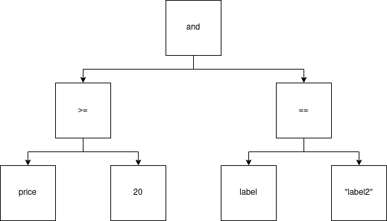

# Json Logic Scala
Build complex rules, serialize them as JSON, and execute them in Scala
Json-logic-scala enables you to serialize in JSON format logical expressions.
It also enables you to load a scala object from a logical expression/JSON.

Due to Scala's strong static typed language nature, json-logic-scala requires JSON to add tell type in json.

### Why would you use json-logic-scala ?
The [JsonLogic format](http://jsonlogic.com/) is designed to allow you to share rules (logic) between
front-end and back-end code (regardless of language difference), even to store
logic along with a record in a database.

Logic that has been exported from another language can be applied quickly on
scala.

### Scala Versions

This project is compiled, tested, and published for the following Scala versions:
1. 2.10.3
2. 2.11.12
3. 2.12.6

## 1. Installation

To get started, add json-logic-scala as a dependency to your project:

* sbt
    ```sbt
    libraryDependencies += "com.github.celadari" %% "json-logic-scala" % "latest.integration"
    ```

* Gradle
    ```gradle
    compile group: 'com.github.celadari', name: 'json-logic-scala_2.12', version: 'latest.integration'
    ```
* Maven
    ```maven
    <dependency>
      <groupId>com.github.celadari</groupId>
      <artifactId>play-json_2.12</artifactId>
      <version>latest.integration</version>
    </dependency>
    ```
Json-logic-scala supports Scala 2.11 and 2.12. Choosing the right JAR is automatically managed in sbt. If you're using Gradle or Maven then you need to use the correct version in the artifactId.

## 2. Main concepts: Boolean-Algebra-Tree
Boolean expressions are complex boolean statements composed of atoms, unary, binary and multiple operators.
Atoms are assigned a value, and can be fed to a binary or unary expression.
For example, the logical expression

<p align="center">
    
</p>

can be parsed to the following Abstract Syntax Tree:

<p align="center">
    
</p>

A tree representation of the logical expression is very convenient. After isolating the outermost operator of the
expression (the operator which is enclosed with the fewest amount of parentheses), the logical expression can be split on
said operator into different branches representing themselves logical expressions. These different expressions can be further
split into different branches until reaching leaves Node which represent single atoms.

Evaluating the logical expression in
its tree representation is evaluated recursively. Each Internal Node needs to have its children nodes evaluated before
being evaluated. Leaf Nodes represent variables/values.

A boolean decision tree is represented by the `JsonLogicCore` class - which has two subtypes:

### 2.1 `ComposeLogic`: Internal Node.
A `ComposeLogic` class is an Internal Node in the boolean-algebra-tree.
It is defined by two fields:
- `operator`: `String` the codename of the operator.
- `conditions`: `Array[JsonLogicCore]` array of sub-conditions this node applies to.

### 2.2 `ValueLogic`: Leaf Node.
It represents a basic value for an operand in order to produce a condition.
It is defined by two fields.
- `operator`: `String` whose value is supposed to be always `"var"`.
- `value`: `T` the value object itself to feed an operand.

## [3. Example]()
Let's suppose you have a parquet/csv file on disk and you want to remember/transfer
filtering rules before loading it.

| price (€) | quantity | label    | label2    | clientID | date                |
|-----------|----------|----------|----------|----------|---------------------|
| 54        | 2        | t-shirts | t-shirts | 245698   | 2018-01-12 09:12:00 |
| 68        | 1        | pants    | shoes    | 478965   | 2019-07-24 15:24:00 |
| 10        | 2        | sockets  | hat      | 478963   | 2020-02-14 16:22:00 |
|...........|..........|..........|..........|..........|.....................|

Let's suppose we are only interested in rows which satisfy logical expression:
$price \gte 20 \and label \neq label2$.
If you want to store the logic (logical expression) in an universal format that can
be shared between scala, R, python code you can store in jsonLogic format.

For the logic:
```json
{
  "and": [{
            "<=": [
                    {"var": "colA", "type": "column"},
                    {"var": "valA", "type": "value"}
                  ]
          },
          {
            "!=": [
                    {"var": "colB", "type": "column"},
                    {"var": "colC", "type": "column"}
                  ]
          }
         ]
}
```
For the values:
```json
{
    "colA": {"name": "price (€)"},
    "valA": {"value": 20, "type": "int"},
    "colB": {"name": "label"},
    "colC": {"name": "label2"}
}
```

## 4. Read/Write json

To use **Json Logic Scala**, you should start by defining or importing a
`JsonLogicCore` instance (we'll see how to evaluate it latter below).

### Type information
A Leaf Node has the following json-logic-scala format
```json
{"var": {...}, "type": "something"}
```
The `"var"` field represents the Leaf Node itself while the `"type"` fields is a string naming the type of the Leaf Node.
This is due to Scala being a strong static type language and types just cannot be inferred automatically from a json string.
Thus, the `"type"` fields is required for telling the JVM how to parse the `"var"` field.

*Json-logic-scala* **comes with built-in naming convention for basic types**

| `"type"` field | Scala type |
|:--------------:|:----------:|
|`"byte"`        | `Byte`     |
|`"short"`       | `Short`    |
|`"int"`         | `Int`      |
|`"long"`        | `Long`     |
|`"string"`      | `String`   |
|`"float"`       | `Float`    |
|`"double"`      | `Double`   |
|`"boolean"`     | `Boolean`  |


### 4.1 Read json: Define Decoder
A decoder defines how to read/parse a JSON string/[JsValue](https://www.playframework.com/documentation/latest/api/scala/play/api/libs/json/JsValue.html)
to a `JsonLogicCore` instance.

* **`Decoder` class must be instantiated** if you need to parse a Json string to a Scala object.
    ```scala
    implicit val decoder = new Decoder
    val myVal = Json.parse(json).as[JsonLogicCore]
    ```

* **Custom scala object/classes**:
    - You *don't need to change built-in naming convention*.
        Just instantiate `Decoder` class and define its `customDecode` method.
        ```scala
        implicit val decoder = new Decoder{
            override def customDecode(json: JsValue, otherType: String): Any =
                  otherType match {
                        case "car" => json.as[Car]
                        case "plane" => json.as[Plane]
                        case _ => throw new IllegalArgumentException("Wrong argument.")
                  }
        }
        ```
        To do so, you just need to indicate new `"type"` field value along with their Scala class/type.

    - You *need to change built-in naming convention*.
        Just instantiate `Decoder` class and override its `decode` method.
        ```scala
        implicit val decoder = new Decoder{
            override def decode(jsonLogic: JsObject, jsonLogicData: JsObject): Any =
                val typeData = (jsonLogic \ "type").as[String]
                val pathData = (jsonLogic \ "var").as[String]
                val jsValue = (jsonLogicData \ pathData).get

                val value = typeData match {
                    case "my_custom_byte_name" => jsValue.as[Byte]
                    case "my_custom_int_name" => jsValue.as[Int]
                      ...
                }
                ValueLogic("var", value)
        }
        ```

    - Take note that you must provide Play JSON library a `Reads` typeclass to define how to read your specific type.
    For [more information on defining a `Reads` typeclass](https://github.com/playframework/play-json#reading-and-writing-objects).
    Fortunately, you usually don't need to implement a `Reads` typleclass directly.
    Play JSON comes equipped with some convenient macros to convert to and from case classes.
    In the following, you just need to define in *companion object* of `case class Car`:
        ```scala
        object Car {
            implicit val carReads: Reads[Car] = Json.reads[Car]
        }
        ```

### 4.2 Write json: Define Encoder
A decoder defines how to write a JSON string/[JsValue](https://www.playframework.com/documentation/latest/api/scala/play/api/libs/json/JsValue.html)
from a `JsonLogicCore` instance.

## 5. Evaluating logical expression: reduce
Evaluating a logical expression and getting its result if the main interest for most cases.
Generally, logic/rules are received from another language/application and we want to apply this logic
to our Scala program.
Evaluating the logical expression is performed by applying a
[reduce](https://en.wikipedia.org/wiki/Fold_(higher-order_function)) function to the boolean-algebra-tree.

### `ReduceLogic` class
Evaluating boolean-algebra-tree can be done by instantiating `ReduceLogic` class and applying `reduce` method on your `JsonLogicCore` instance.
```scala
val condition: JsonLogicCore = ...
val reducer = new ReduceLogic
val result = reducer.reduce(condition)
```

The `reduce` method applies two sub-methods depending if the Node is an Internal Node or a Leaf Node.

### 5.1 `reduceValueLogic` method
- `def reduceValueLogic(condition: ValueLogic[_]): Any`
- It is called by the `reduce` method on `ValueLogic` conditions.
- Current built-in json-logic-scala implementation returns the Leaf Node `ValueLogic` instance's `value`.

### 5.2 `reduceComposeLogic` method
- `def reduceComposeLogic(condition: ComposeLogic): Any`
- It is called by the `reduce` method on `ComposeLogic` conditions.
- Defines for which `operator` string value, which Scala comparator function should be applied.
- Comes with **built-in naming convention for operators** and **built-in Scala comparators function**.


*Json-logic-scala* comes with built-in comparators which are split into 3 different categories:
`CompareOperator`, `ContainsOperator`, `BooleanOperator`.


There are several ways to define a **custom `reduceComposeLogic`** method:

#### 5.2.1 Define custom comparators methods
Good option if you **need to add new types** but **don't need to change the comparator functions for built-in/basic types** and
**don't need to change built-in naming convention for operators**.

*Json-logic-scala* provides comparator functions for basic types: `Byte`, `Short`, `Int`, `Long`, `Float`, `Double`.
Those comparators are implicit parameters of `ReduceLogic` loaded at instantiation.

If you need to define comparison behavior to compare a new type to other types you need to implement methods
among the following:

|     package      |              Scala function                   |                  Behavior that it defines                   |
|:------------:    |:----------------------------------------------|:-----------------------------------------------------------:|
| CompareOperator  |`def negateCustom(value: Any): Any`            |negate operator for custom types in CompareOperator package  |
| CompareOperator  |`def cmpCustomLong(a: Long, b: Any): Any`      | <= operator between `Long` and custom types                 |
| CompareOperator  |`def cmpCustomDouble(a: Double, b: Any): Any`  | <= operator between `Double` and custom types               |
| CompareOperator  |`def cmpCustom(a: Any, b: Any): Any`           | <= operator between custom types themselves                 |
| CompareOperator  |`def eqCustomLong(a: Long, b: Any): Any`       | = operator between `Long` and custom types                  |
| CompareOperator  |`def eqCustomDouble(a: Double, b: Any): Any`   | <= operator between `Double` and custom types               |
| CompareOperator  |`def eqCustom(a: Any, b: Any): Any`            | = operator between custom types themselves                  |
| ContainsOperator |`def containsCustom(a: Any, b: Any): Any`      | contains operator between custom types themselves           |
| ContainsOperator |`def negateCustom(value: Any): Any`            | negate operator for custom types in ContainsOperator package|
| BooleanOperator  |`def andCustom(a: Any, b: Any): Any`           | and operator between custom types                           |
| BooleanOperator  |`def andCustomBoolean(a: Boolean, b: Any): Any`| and operator between `Boolean` type and custom types        |
| BooleanOperator  |`def orCustom(a: Any, b: Any): Any`            | or operator between custom types                            |
| BooleanOperator  |`def orCustomBoolean(a: Boolean, b: Any): Any` | or operator between `Boolean` type and custom types         |
| BooleanOperator  |`def negateCustom(value: Any): Any`            | negate operator for custom types in BooleanOperator package |

#### 5.2.2 Redefine main comparators methods
Good option if you **need to change the comparator functions for built-in/basic types** and
**don't need to change built-in naming convention for operators**.

You just need to override among the following comparator methods:

|     package      |              Scala function                   |                  Behavior that it defines                              |
|:----------------:|:----------------------------------------------|:----------------------------------------------------------------------:|
| CompareOperator  |`def eq(a: Any, b: Any): Any`                  | = operator for all different types in CompareOperator package          |
| CompareOperator  |`def negate(value: Any): Any`                  | ! operator for all different types in CompareOperator package          |
| CompareOperator  |`def cmp(a: Any, b: Any): Any`                 | <= operator for all different types in CompareOperator package         |
| ContainsOperator |`def contains(a: Any, b: Any): Any`            | contains operator for all different types in ContainsOperator package  |
| ContainsOperator |`def negate(value: Any): Any`                  | ! operator for all different types in ContainsOperator package         |
| BooleanOperator  |`def and(a: Any, b: Any): Any`                 | ! operator for all different types in ContainsOperator package         |
| BooleanOperator  |`def or(a: Any, b: Any): Any`                  | ! operator for all different types in ContainsOperator package         |
| BooleanOperator  |`def negate(value: Any): Any`                  | ! operator for all different types in ContainsOperator package         |


#### 5.2.3 Redefine `reduceComposeLogic` method
Good option if you **need to add new operators**.

*Example*: let's imagine we just want to add the `"if"` condition.
```scala

implicit val reducer = new ReduceLogic() {
    override def reduceComposeLogic(condition: ComposeLogic): Any = {
        condition.operator match {
            case "if" => ifCondition(condition.conditions)
            case other => super.reduceComposeLogic(condition)
        } 
    }

    def ifCondition(conditions: Array[JsonLogicCore]): Any = {
          ...
    }
}
```

## 6. More examples

[More detailed examples can found here](examples/)


## Scaladoc API

The Scaladoc API for this project can be found [here](http://celadari.github.io/json-logic-scala/latest/api).

## License

*Json Logic Scala* is licensed under the MIT License.

    MIT License

    Copyright (c) 2019 celadari

    Permission is hereby granted, free of charge, to any person obtaining a copy
    of this software and associated documentation files (the "Software"), to deal
    in the Software without restriction, including without limitation the rights
    to use, copy, modify, merge, publish, distribute, sublicense, and/or sell
    copies of the Software, and to permit persons to whom the Software is
    furnished to do so, subject to the following conditions:

    The above copyright notice and this permission notice shall be included in all
    copies or substantial portions of the Software.

    THE SOFTWARE IS PROVIDED "AS IS", WITHOUT WARRANTY OF ANY KIND, EXPRESS OR
    IMPLIED, INCLUDING BUT NOT LIMITED TO THE WARRANTIES OF MERCHANTABILITY,
    FITNESS FOR A PARTICULAR PURPOSE AND NONINFRINGEMENT. IN NO EVENT SHALL THE
    AUTHORS OR COPYRIGHT HOLDERS BE LIABLE FOR ANY CLAIM, DAMAGES OR OTHER
    LIABILITY, WHETHER IN AN ACTION OF CONTRACT, TORT OR OTHERWISE, ARISING FROM,
    OUT OF OR IN CONNECTION WITH THE SOFTWARE OR THE USE OR OTHER DEALINGS IN THE
    SOFTWARE.
