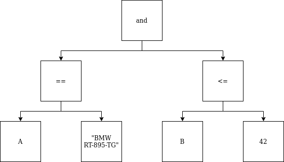
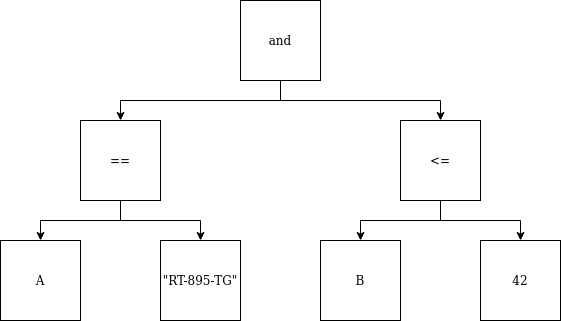




## What is `EvaluatorValueLogic` ?

An object implementing `EvaluatorValueLogic` interface is called before evaluation.
This object transforms leaf values in the abstract syntax tree.

## Why to use an `EvaluatorValueLogic` ?

The object lets you to enable custom pre-treatments on JSON in
Json-Logic-Typed format.

Imagine you need to share common JSON in Json-Logic-Typed format between several
components (frontend/backend/data).
You also need to elaborate a custom pre-treatment specific to
each of these components.

**Example**

Let's suppose you receive JSON in Json-Logic-Typed format.
One of the leaf nodes (in the syntax tree) is a string representing a car as:
brand + vehicle registration number.



Imagine that all your defined logic and operators needs be applied on only
the vehicle registration number.

 `EvaluatorValueLogic` is all you need to handle this for you.
For example, evaluation could be performed not on the previous expression
(syntax tree) but the following one.



## How to define a custom `EvaluatorValueLogic` ?

A custom object that implements  `EvaluatorValueLogic` is defined by the Type
that it is associated to.

**Example**:
In the previous example, the associated Type with the `EvaluatorValueLogic`
implementation object would be `{"codename": "string"}`.

`EvaluatorLogicConf` defines how Types are mapped with `EvaluatorValueLogic`,
with the last one being given as init parameter to `EvaluatorLogic`.

In the `EvaluatorLogicConf` object, information is contained through the parameters
`valueLogicTypeToReducerMetaInfAdd` and `valueLogicTypeToReducerManualAdd`.
They are mappings of `Type` to `EvaluatorValueLogic`.

You need to pass only your `EvaluatorValueLogic` mapping object to the
`EvaluatorLogicConf.createConf` method.

```scala
val myStringEvaluatorValueLogic = ...
val valueLogicTypeToReducerManualAdd = Map(SimpleTypeValue("string") -> myStringEvaluatorValueLogic)
implicit val confEvaluator = EvaluatorLogicConf.createConf(valueLogicTypeToReducerManualAdd=valueLogicTypeToReducerManualAdd)
val evaluator = new EvaluatorLogic
evaluator.eval(...)
```

## How to implement a custom operator ?

Implementing  the `EvaluatorValueLogic` trait only requires to implement `` method.

*Example:*
Based on the previous example
```scala
object CustomEvaluatorValueLogic extends EvaluatorValueLogic {
  def evaluateValueLogic(value: Any): Any = {
    value match {
      case string: String => ...
      case _ => throw ...
    }
  }
}

val valueLogicTypeToReducerManualAdd = Map(SimpleTypeValue("string") -> CustomEvaluatorValueLogic)
implicit val confEvaluator = EvaluatorLogicConf.createConf(valueLogicTypeToReducerManualAdd=valueLogicTypeToReducerManualAdd)
val evaluator = new EvaluatorLogic
evaluator.eval(...)
```

## Define an `EvaluatorValueLogic`: as a service

Please refer to [Advanced: Define custom object as Java Services]()


